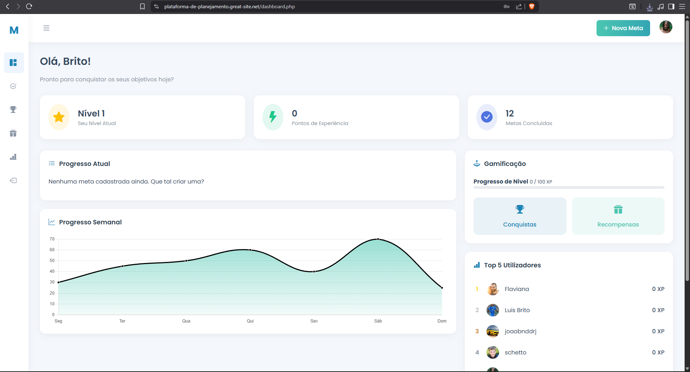
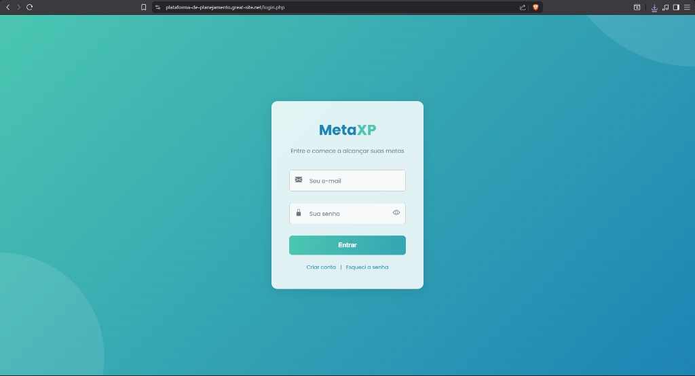
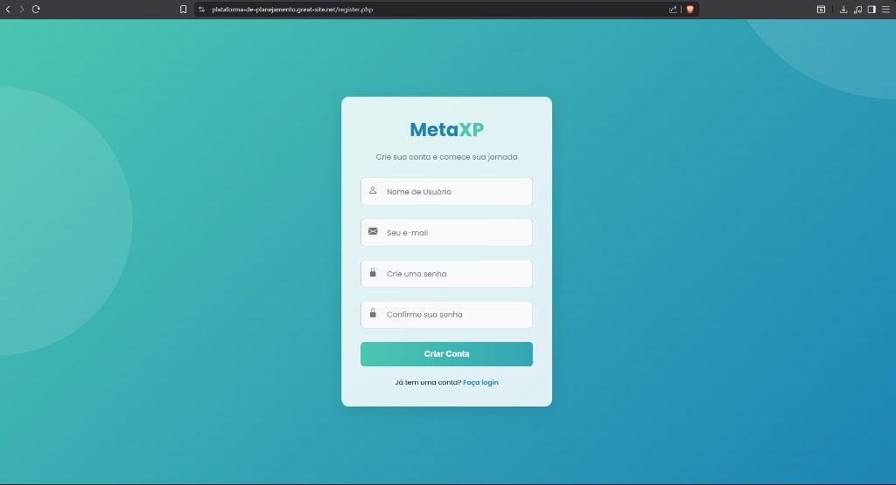

# 🚀 MetaXP: Planejamento de Metas com Gamificação e IA


> **Projeto Integrador** desenvolvido para o curso de Análise e Desenvolvimento de Sistemas (UniCEUB).

## 🎯 Sobre o Projeto
O **MetaXP** é uma plataforma web inovadora que visa combater a procrastinação transformando o gerenciamento de metas pessoais em um **RPG da vida real**.

O sistema utiliza **Inteligência Artificial** para atuar como um "Mentor Virtual", analisando os objetivos do usuário e sugerindo cronogramas realistas, quebrando grandes metas em pequenas "quests" diárias para facilitar a execução.


## ✨ Funcionalidades Principais

### 🎮 Sistema de Gamificação
- **XP e Níveis:** O usuário ganha pontos de experiência (XP) ao concluir tarefas no prazo.
- **Rankings e Conquistas:** Sistema de recompensas visuais para manter o engajamento.
- **Barra de Progresso:** Visualização clara da evolução do usuário em cada categoria de vida (Saúde, Estudos, Carreira).


### 🤖 Integração com IA
- **Assistente Inteligente:** O sistema consome uma API de IA para sugerir a quebra de tarefas complexas (Ex: "Aprender Python" vira "Instalar IDE", "Fazer Hello World", etc.).
- **Feedback Automático:** Análise de desempenho baseada no histórico de conclusão.


### ⚙️ Gestão Completa (CRUD)
- Cadastro seguro de usuários.
- Criação, Edição e Exclusão de Metas e Tarefas.
- Dashboard administrativo para controle pessoal.

## 🛠️ Tecnologias Utilizadas

* **Front-end:** HTML5, CSS3 (Responsivo) e JavaScript (Manipulação do DOM).
* **Back-end:** PHP 8 (Estruturado).
* **Banco de Dados:** MySQL (Relacional).
* **Hospedagem:** InfinityFree.
* **Versionamento:** Git e GitHub.

## 📸 Galeria do Projeto

<div align="center">
  <h3>🏠 Dashboard Principal</h3>
  
  <br><br>
  
  <h3>📱 Tela de Login e Cadastro</h3>
  <div style="display: flex; justify-content: center; gap: 20px;">
    
    
  </div>
</div>

## 🚀 Como acessar
O projeto está hospedado e rodando online! Você pode testar as funcionalidades através do link abaixo:

👉 **[CLIQUE AQUI PARA ACESSAR O SISTEMA](https://plataforma-de-planejamento.great-site.net/register.php)**

---

## 💻 Instalação Local (Para Desenvolvedores)
Caso queira rodar este projeto na sua máquina:

1.  **Clone o repositório:**
    ```bash
    git clone [https://github.com/britoxzn/metaxp-gamificacao-ia.git](https://github.com/britoxzn/metaxp-gamificacao-ia.git)
    ```
2.  **Configure o Ambiente:**
    - Instale o XAMPP ou WAMP Server.
    - Mova a pasta do projeto para dentro do `htdocs`.
3.  **Banco de Dados:**
    - Importe o arquivo `database.sql` no seu PHPMyAdmin.
    - Configure o arquivo `conexao.php` com suas credenciais locais.

---
Desenvolvido por **Luis Brito** 👨‍💻
